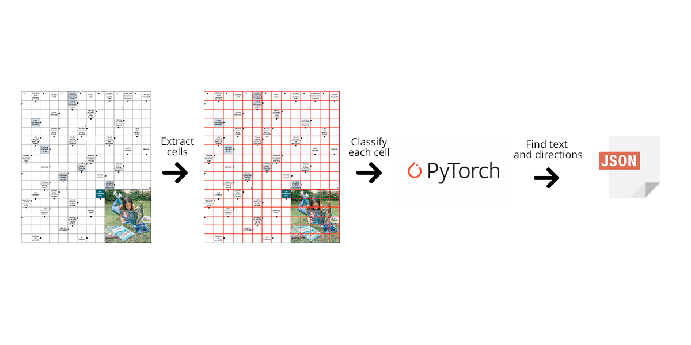

# Crossword Data Extraction CLI Tool

  **Checkout my writeup regarding this problem:**
[Here](https://artkulakov.com/post/understanding-crossword-puzzles-with-opencv-ocr-and-dnns/)

With the help of this command line tool you can extract the following data from the French crosswords (changing the language is fairly easy though):
1. Description of each word
2. Direction of each word
3. The starting cell index for each word

The pipeline is the following: The script cuts the input image on cells (using OpenCV), then it applies the trained classifier written in PyTorch in order to classifty each cell on the classes like: different arrow variations, single text, double text, other (you can find all classes in the `JsonExtractor/training_data/` folder. If the cell is a text, then the algorithm extracts the text using Pytesseract. If the frame is an arrow, then the corresponding text is found, in order to find the direction and the starting cell of the word.

## Instructions
1. Clone the repo and run `pip -r install requirements.txt`
2. `cd JsonExtractor/`
3. Run the app with `python extractJson.py --path <path to the crossword file>` (you can use `JsonExtractor/data/p1_2.png` for reference)
4. Find the resulting json information in the same folder.

